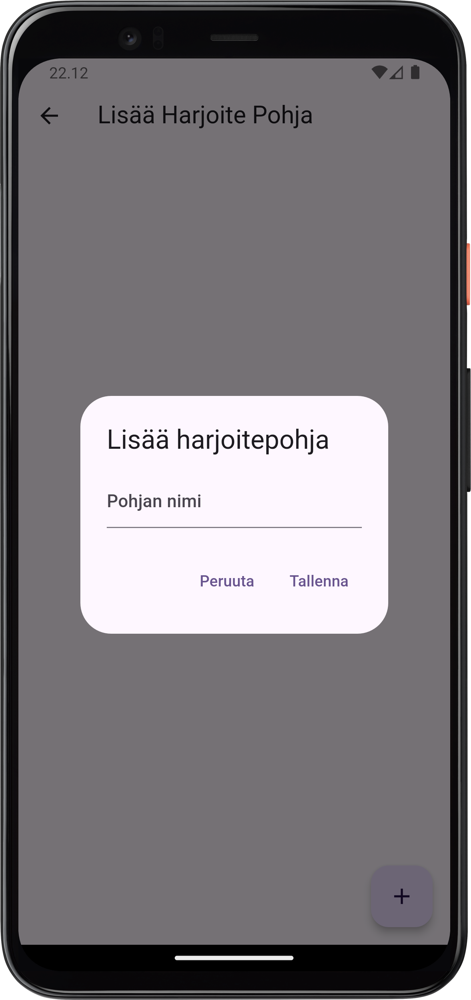
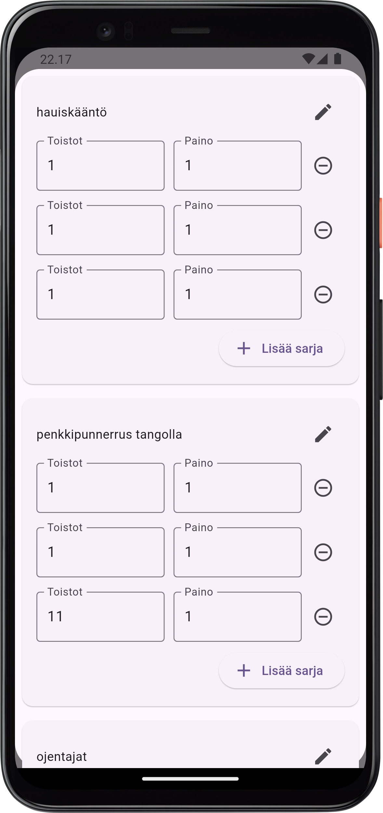
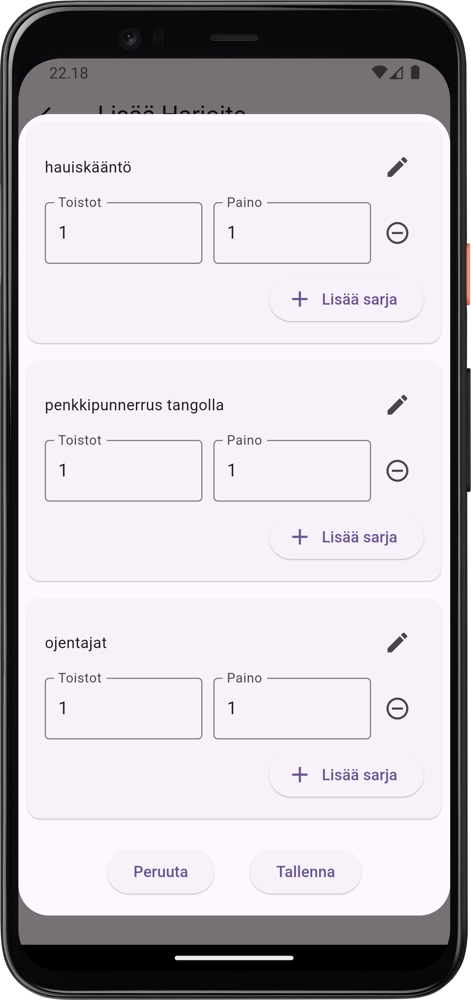
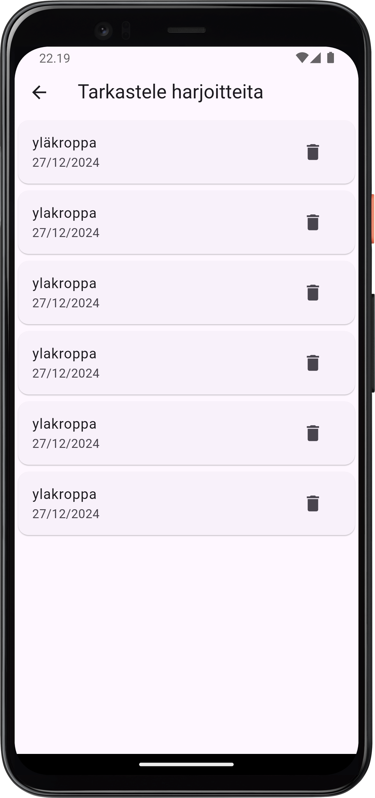
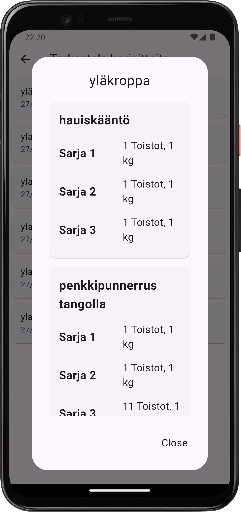
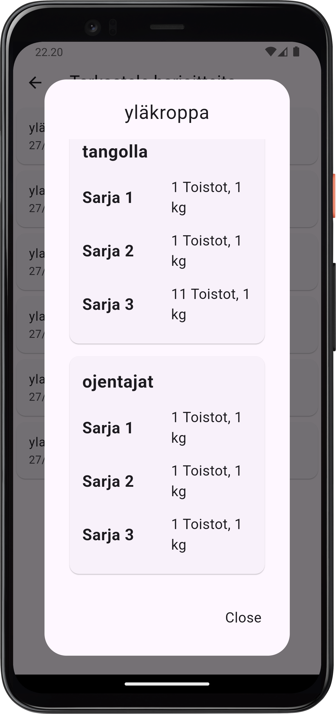

# gymdiary mobile app with flutter

## Ajatus

Ajatuksena tällä projektilla on luoda oma kuntosaliharjoitteiden seurantaan rakennettu standalone puhelin sovellus. Sovellus on rakennettu flutterilla käyttäen sovelluksen sisäistä databasea sqfliteä. Sovellus on kaksi kielinen: Englanti ja Suomi.

## Appi

Kotisivu englanniksi.

 
-----
 

Kotisivu suomeksi.

 
-----
 

Harjoitepohjan luominen.

 
-----
 

Luotujen harjoitepohjien näkymä.

 
-----
 

Liikkeen lisäämisnäkymä.

 
-----
 

Tehtävän harjoitteen valitseminen.

 
-----
 

Harjoitekaavake täyttyy edellisen treenikerran tiedoilla automaattisesti.

 
-----
 

Harjoitteita pystyy dynaamiesti muokkaamaan kesken treenin. Toistomääriä ja liikeen nimeä voi muokata.

 
-----
 

Treenikerrat näkyvät listassa. Jokaista yksittäistä treeniä voi silmäillä valitsemalla treenin.

 
-----
 

Treenikerran tulosten tarkastelu.

 
-----
 
