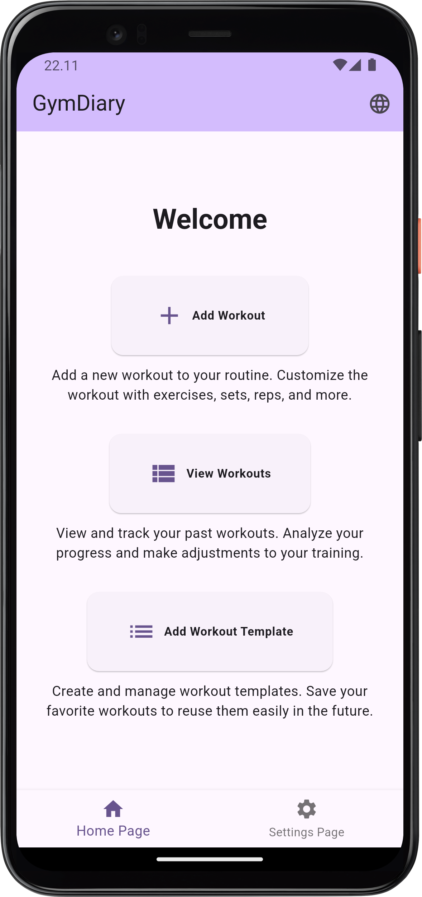
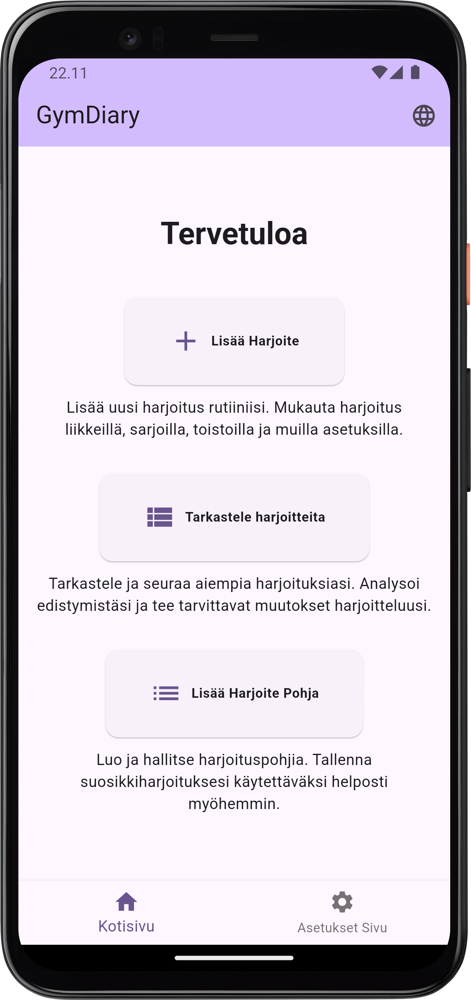
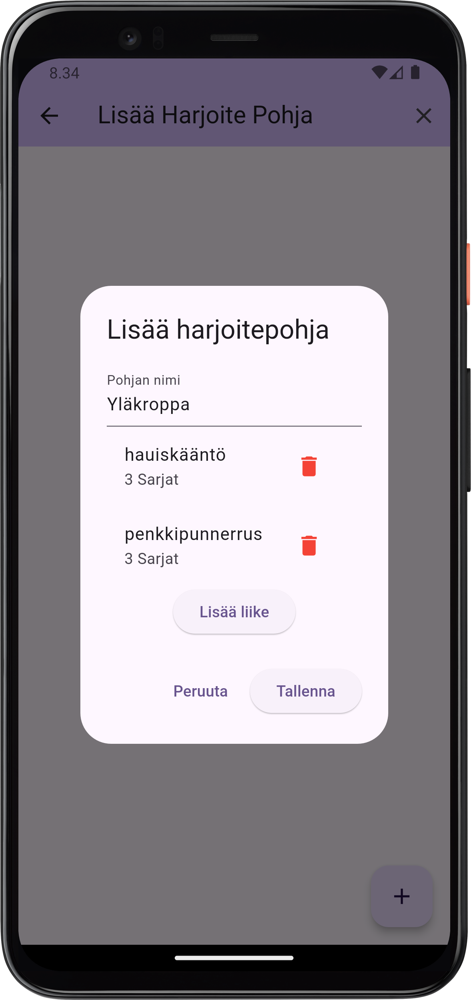
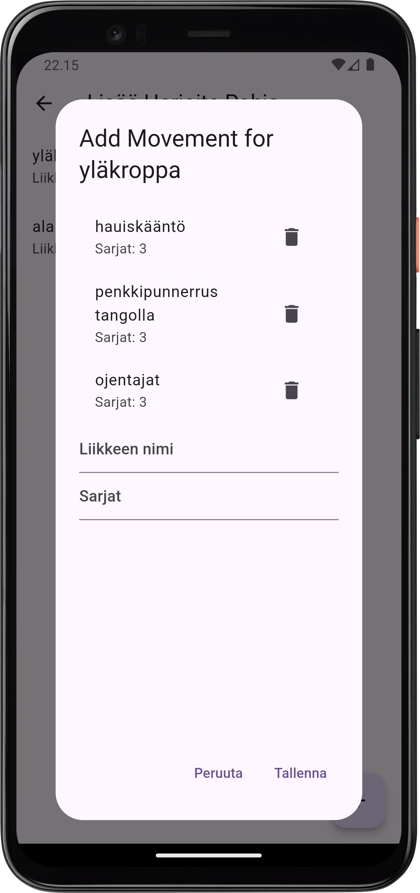
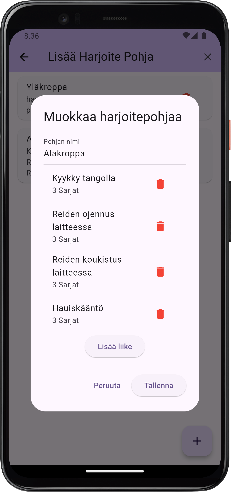

# gymdiary mobile app with flutter

## Ajatus

Ajatuksena tällä projektilla on luoda oma kuntosaliharjoitteiden seurantaan rakennettu standalone puhelin sovellus. Sovellus on rakennettu flutterilla käyttäen sovelluksen sisäistä databasea sqfliteä. Sovellus on kaksi kielinen: Englanti ja Suomi.

## Appi

Kotisivu englanniksi

Kotisivu suomeksi

Harjoitepohjan luominen

Luotujen harjoitepohjien näkymä

Jo luotujen harjoitepohjien muokkaaminen mielekkäämmäksi kuten tässä ollaan lisätty hauiskääntöä jalkapäivään :D

